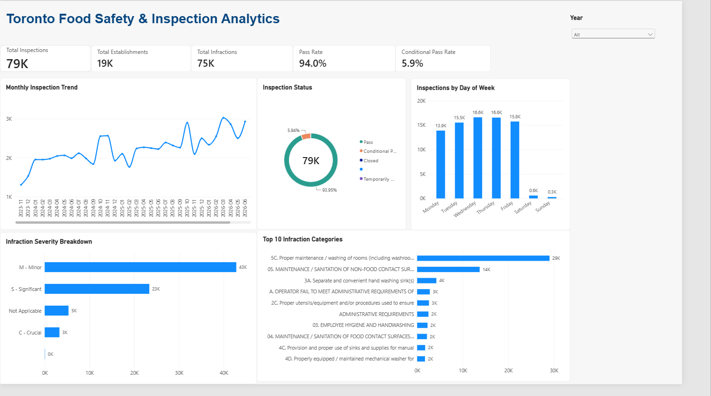
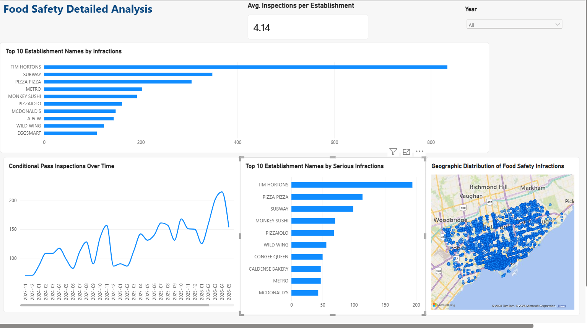

# Toronto Food Safety & Inspection Analytics

An interactive Power BI dashboard analyzing Toronto food safety inspection data to explore inspection outcomes, infraction severity, recurring issues, temporal patterns, and geographic distribution.

## Project Overview

This project analyzes publicly available Toronto food safety inspection data to answer questions such as:

- How do inspection outcomes change over time?
- What types of food safety infractions occur most frequently?
- Which establishment names account for the highest number of infractions?
- Which establishments have the most significant or crucial infractions?
- How are food safety infractions geographically distributed across Toronto?
- Are there noticeable patterns in inspection activity by month or day of the week?

## Dashboard

### Overview

The Overview page provides a high-level summary of inspection activity, including:

- Total inspections
- Total establishments
- Total infractions
- Pass and Conditional Pass rates
- Monthly inspection trends
- Inspection status distribution
- Infraction severity breakdown
- Most common infraction categories
- Inspection activity by day of the week

### Detailed Analysis

The Detailed Analysis page explores:

- Average inspections per establishment
- Establishment names with the most infractions
- Establishment names with the most serious infractions
- Conditional Pass trends over time
- Geographic distribution of food safety infractions
- Interactive filtering by year

## Data Preparation

Data cleaning and transformation were performed in Power Query, including:

- Data type validation and correction
- Handling missing and invalid values
- Identification and exclusion of malformed source records
- Standardization of severity labels
- Renaming fields for analytical clarity
- Creation of a derived inspection identifier
- Validation of inspection-level status consistency

## Data Model

A dedicated date dimension was created and related to the inspection data to support time-based analysis.

**Fact table:** `FactInspections`  
**Date dimension:** `DimDate`

The date dimension includes year, month, year-month, quarter, and day-of-week attributes.

## DAX Measures

Key measures include:

- Total Inspections
- Total Establishments
- Total Infractions
- Pass Rate
- Conditional Pass Rate
- Crucial Infractions
- Significant Infractions
- Minor Infractions
- Serious Infractions
- Average Inspections per Establishment

## Tools & Skills

- Power BI
- Power Query
- DAX
- Data Cleaning
- Data Modeling
- Data Visualization
- Exploratory Data Analysis
- Geographic Analysis

## Data Source

City of Toronto Open Data — DineSafe food safety inspection data.

The analysis uses the current inspection dataset available at the time of the project. September 2026 represents a partial month in the dataset.

## Repository Contents

- `Toronto_Food_Safety_Analytics.pbix` — Power BI report
- `overview.png` — Overview dashboard
- `detailed_analysis.png` — Detailed Analysis dashboard
- `README.md` — Project documentation

## Key Takeaway

The dashboard provides an interactive view of Toronto food safety inspection activity, highlighting differences in inspection outcomes, infraction severity, recurring issues, temporal patterns, and geographic concentration.
